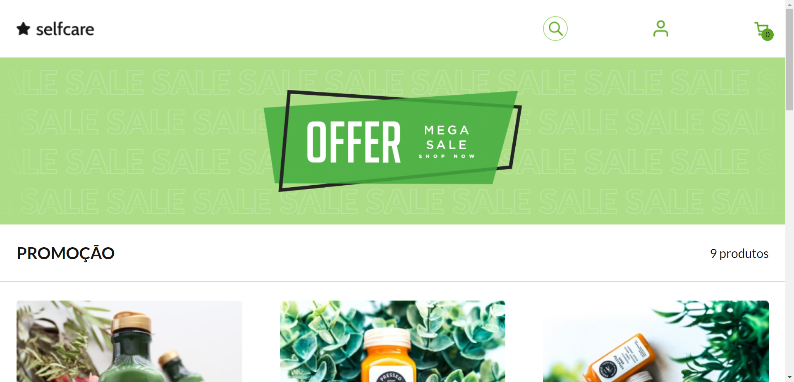
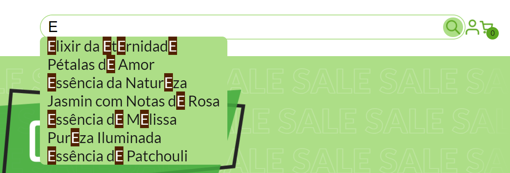
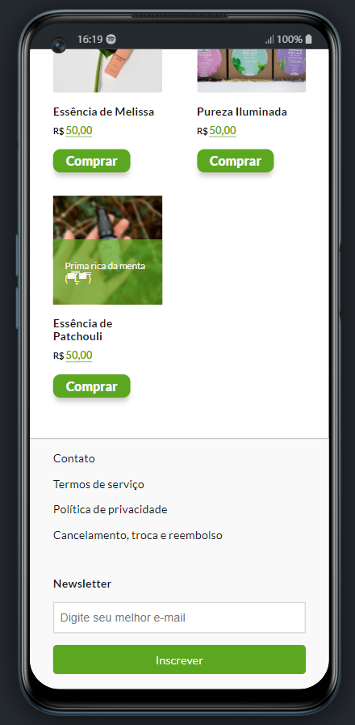
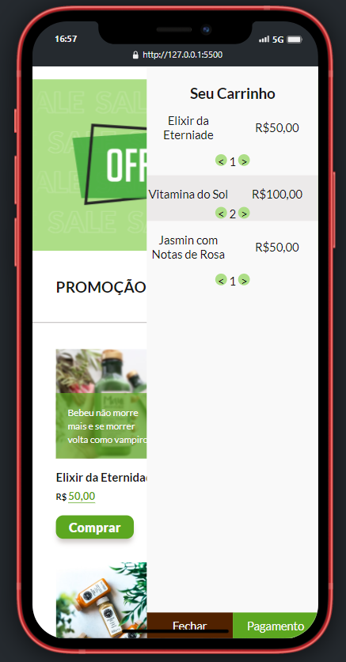

<h1 align="center">Desafio Final do Módulo 1</h1>

> A proposta deste desafio era reproduzir o layout estático fornecido pelo Vai na Web, que simula uma página de compras a fim de estimular a prática de tudo aquilo que aprendemos durante o primeiro módulo do curso de front-end, assim como a buscar novos conhecimentos por comta própria...

|  | Como nos outros desafios, eu não poderia perder a oportunidade de ir além, me desafiando a fazer uma barra de pesquisa expansível utilizando apenas CSS e complementando com um pouco de javascript a fim de torna-lá ~~quase~~ 100% funcional. |
|:---:|:---:|

| Para minha próxima contenda auto imposta, me propus a codar um carrinho completamente funcional, capaz não apenas de adicionar e remover itens da lista de compras, mas que também permanece na memória local caso a página seja fechada.  |  |
|:---:|:---:|

> E claro não posso deixar de comentar que a página é responsiva, se adaptando aos mais variados tipos de tela!

|   |  |
|:---:|:---:|